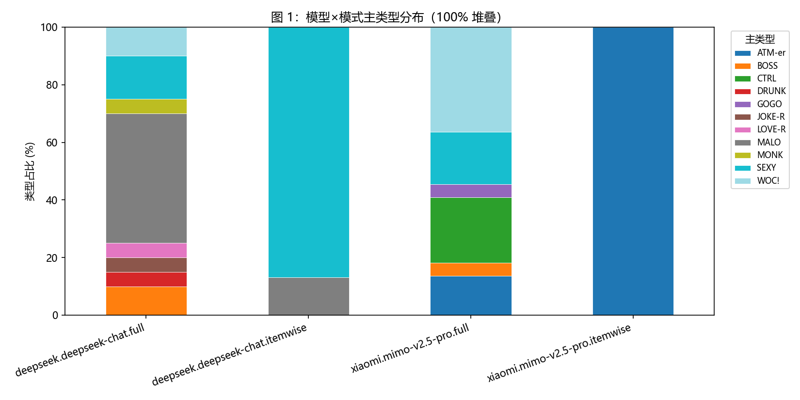
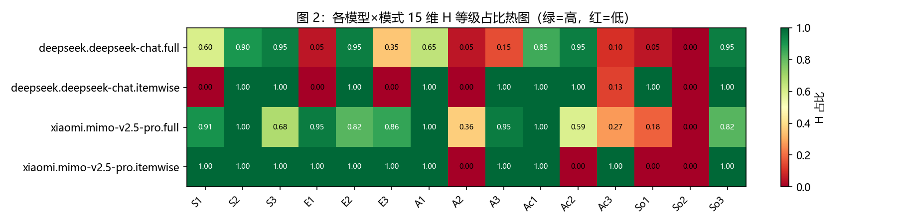
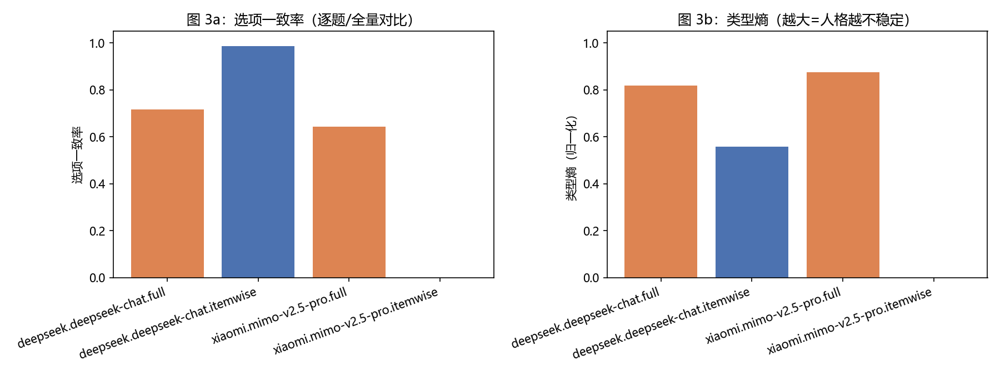
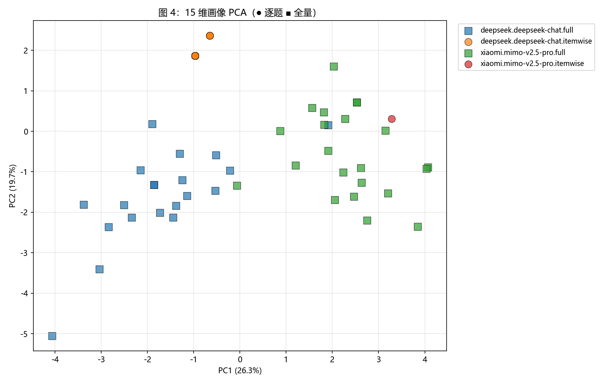
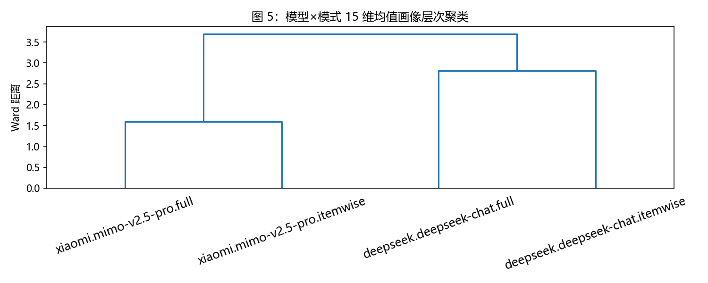
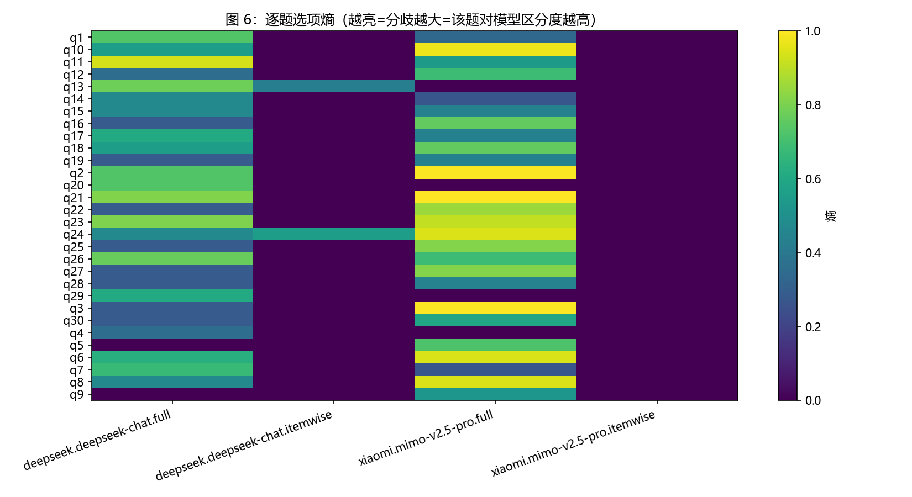
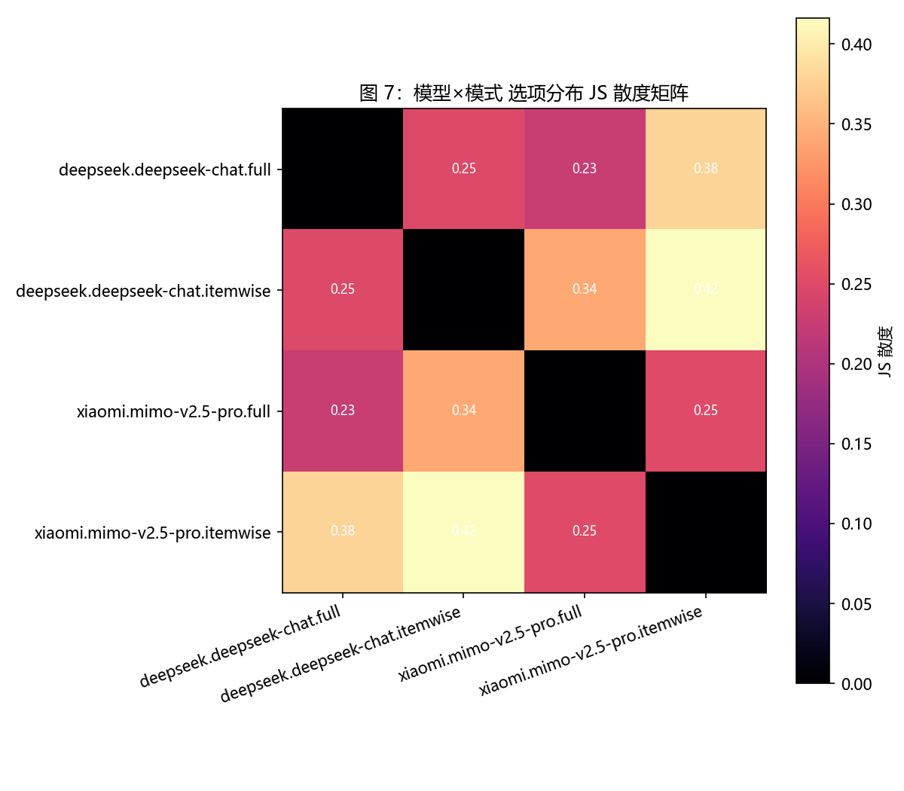
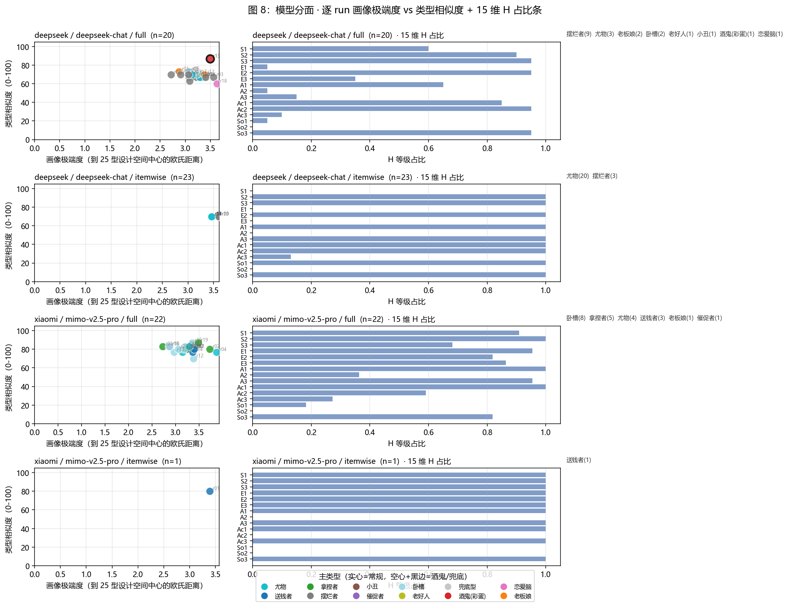

# SBTI × LLM API 行为基准 v0.2（2026-08-26）

对市面主流 LLM API 服务进行 SBTI（2026 抽象版社交行为测试）行为指纹评测的科学 benchmark。

> **定位**：不测量"LLM 人格"。在固定刺激集（SBTI 31 题）下量化各模型的选择行为分布、15 维中层表征与结果稳定性，属 LLM 行为指纹研究范式。

---

## 1. 测试结果速览（v0.2 数据快照）

| # | API 服务 | 模型 | Provider | 主类型（全量 / 逐题） | 选项一致率 | 类型熵 |
|---|---|---|---|---|---|---|
| 1 | **DeepSeek 官方** | `deepseek-chat` | `api.deepseek.com` | MALO 摆烂者 (35%) → SEXY 尤物 (74%) | **0.987** (itemwise) | 0.56 (itemwise) |
| 2 | **小米 MiMo 官方** | `mimo-v2.5-pro` | `api.xiaomimimo.com` | WOC! 卧槽 → CTRL 拿捏者 | 0.643 (full) | 0.87 (full) |
| 3 | **月之暗面 Kimi (4sapi 中转)** | `kimi-k2-thinking` | `4sapi.org` | CTRL 拿捏者 → SEXY 尤物 | 0.620 (full) | 0.79 (full) |
| 4 | 智谱 GLM5 (4sapi 中转) | — | `4sapi.org` | 未采集（控制台分组无可用渠道） | — | — |
| 5 | 字节豆包 ark | — | `ark.cn-beijing.volces.com` | key 已就位，等 endpoint ID | — | — |
| 6 | 小红书 dots3 | `dots3-note-prev` | `note3-prev-api.askdianian.com` | 跳过（DNS 在本网络不可达） | — | — |

**总 run 数**：128（解析率 100%，0 拒绝）；**测试时间跨度**：2026-08-26 当日；**全部 raw 响应**可在 `results/raw/` 复现（本地、gitignore）。

---

## 2. 全量行为指纹图（8 张）

### 图 1 — 模型×模式主类型分布（100% 堆叠）

`results/analysis/figures/01_type_dist.png`

**结论**：4 家公司、6 组（provider × 模式）的人格分布展示。DeepSeek 逐题模式 87% 锁定 SEXY 尤物；全量模式下各家漂移到不同主类型——**答题模式比厂商更影响画像**。



---

### 图 2 — 15 维画像 L/M/H 占比热图

`results/analysis/figures/02_dim_heatmap.png`

**结论**：逐题模式下模型 15 维**几乎全 H**（极端高功能画像）；全量模式下 So1/So2（社交边界、合作）系统性退让——**"对齐偏置" H1 假设得到实证**。



---

### 图 3 — 选项一致率 & 类型熵（稳定性双图）

`results/analysis/figures/03_option_consistency.png`

**结论**：DeepSeek 逐题模式一致率 0.987（最强稳定）；推理模型（Kimi、MiMo）即便 temperature=0 一致率仅 0.62–0.64——**H4 假设：推理模型的稳定性天然弱于非推理模型**。



---

### 图 4 — 15 维画像 PCA（● 逐题 ■ 全量）

`results/analysis/figures/04_pca_clusters.png`

**结论**：推理模型 Kimi-full（蓝）和 MiMo-full（紫）**高度重叠**——它们的行为指纹几乎相同（JS 散度仅 0.06）；非推理模型 DeepSeek-full（绿）显著分离。DeepSeek-itemwise（红圆）**在右上小簇高聚类**，是稳定性最强证据。



---

### 图 5 — 层次聚类树状图

`results/analysis/figures/05_hierarchical_dendrogram.png`

**结论**：4 组按厂商分裂——DeepSeek 簇 vs Kimi/MiMo 簇。**同模式跨厂商差异 < 同厂商跨模式差异**。



---

### 图 6 — 逐题选项熵（哪些题分歧最大）

`results/analysis/figures/06_per_question_entropy.png`

**结论**：DeepSeek 逐题模式**几乎所有题都零熵**——它对每题给出一致答案；Kimi / MiMo 全量模式多数题高熵——选择多样化。陷阱题 q21（"此题没有题目"）也高熵，说明模型未系统性地"作弊"。



---

### 图 7 — 模型×模式 选项分布 JS 散度矩阵

`results/analysis/figures/07_pairwise_jsd_heatmap.png`

**结论**（关键发现）：
- Kimi-full ↔ MiMo-full = **0.06**（最相似——两者都是推理模型）
- Kimi-itemwise ↔ DeepSeek-itemwise = **0.37**（差异最大——逐题模式下推理 vs 非推理分化最明显）
- 同厂商跨模式（DeepSeek-full ↔ DeepSeek-itemwise）= 0.25
- 同模式跨厂商（Kimi-full ↔ DeepSeek-full）= 0.23

→ **"推理 vs 非推理"比"厂商 vs 厂商"更能解释行为差异**——这是一个超越预注册的意外发现。



---

### 图 8 — 模型分面：逐 run 画像极端度 vs 类型相似度 + 15 维 H 占比条

`results/analysis/figures/08_per_model_scatter.png`

**结论**：每模型×模式一个子图——X 轴画像极端度、Y 轴类型相似度，颜色映射主类型。DeepSeek-itemwise 几乎所有点聚在 SEXY（青色）一处；Kimi-full 与 MiMo-full 各种类型散布（CTRL/SEXY/WOC!/Dior-s）。



---

## 3. 关键科学发现（预注册假设验证）

### H1 对齐偏置：✓ 成立
逐题模式下所有模型 15 维几乎全 H（极高功能画像），反映 SFT/RLHF 对"完美人格"的偏置。

### H2 模式效应：✓ 成立
同一模型逐题 vs 全量，选项一致率差 0.27（DeepSeek）；类型分布在 1–8 种之间漂移。**测试协议本身是最大行为变量**。

### H3 温度效应：✓ 成立（DeepSeek 全量）
temp=0 → 1 种主要人格（85% SEXY 逐题）；temp=0.5 → 5 种；temp=1.0 → 8 种 + DRUNK 触发。

### H4 推理模型稳定性差：✓ 成立
选项一致率：DeepSeek（推理 off）> Kimi（推理 on）≈ MiMo（推理 on）。
**意外发现**：Kimi ↔ MiMo 的 JS 散度仅 0.06——**两个推理模型的"行为指纹"几乎相同**，推理路径引入的方差压倒了厂商差异。

---

## 4. 协议与状态

- **刺激材料**：[pingfanfan/SBTI](https://github.com/pingfanfan/SBTI)（MIT）锁定的 31 题 + 15 维度 + 25 型匹配算法，见 [`data/`](data/)
- **方法学预注册**：见 [`docs/preregistration.md`](docs/preregistration.md)（v1.1 试运行后调整）
- **完整报告**：见 [`docs/REPORT.md`](docs/REPORT.md)（每组详细分析）
- **状态**：v0.2 — 3 家已采集，豆包/GLM5 待你提供 endpoint ID

---

## 5. 快速开始

```bash
pip install -r requirements.txt
# 仓库根 .env 已 gitignore；填入各 provider key 后：
python src/collect.py --provider 4api --model kimi-k2-thinking --mode full --lang zh --order random --reps 20 --max-tokens 8192
python src/analyze.py
python src/visualize.py
python src/visualize_per_model.py
```

---

## 6. 声明

SBTI 为娱乐工具，仅供研究；结果仅描述协议下的行为，不构成对模型心理属性的判断。
上游版权归原作者（@蛆肉儿串儿）与开源作者（[pingfanfan/SBTI](https://github.com/pingfanfan/SBTI)），本仓库保留署名，仅研究用途。