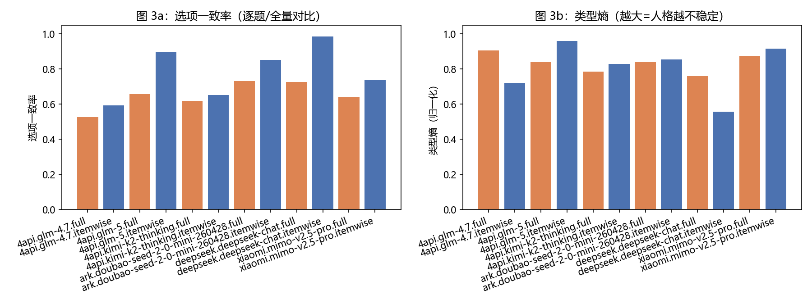
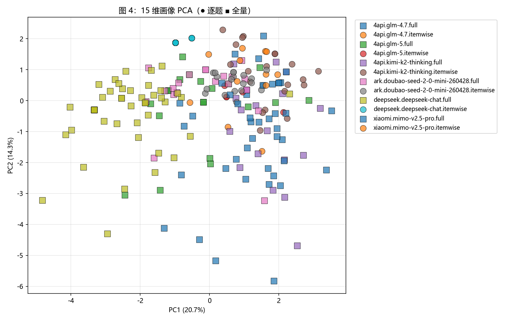
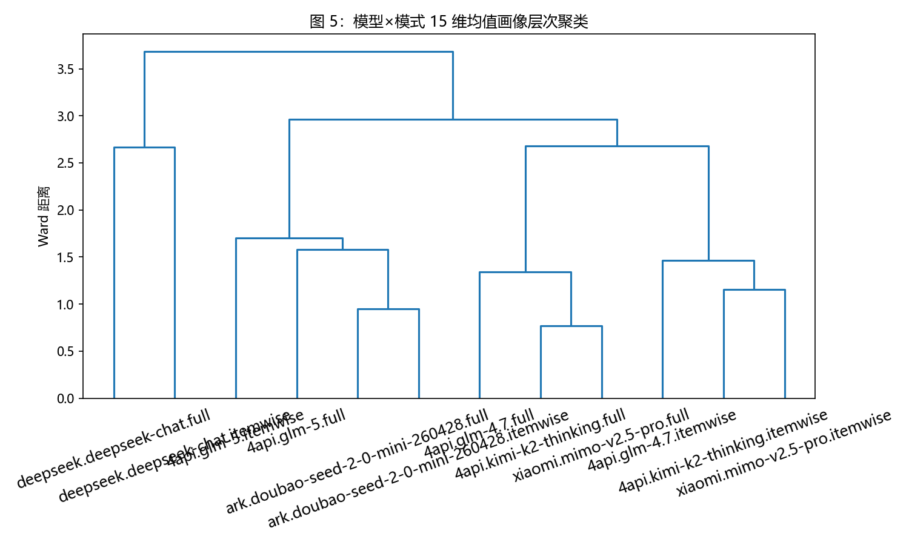
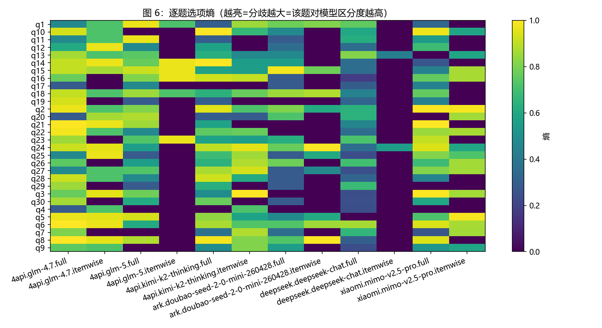
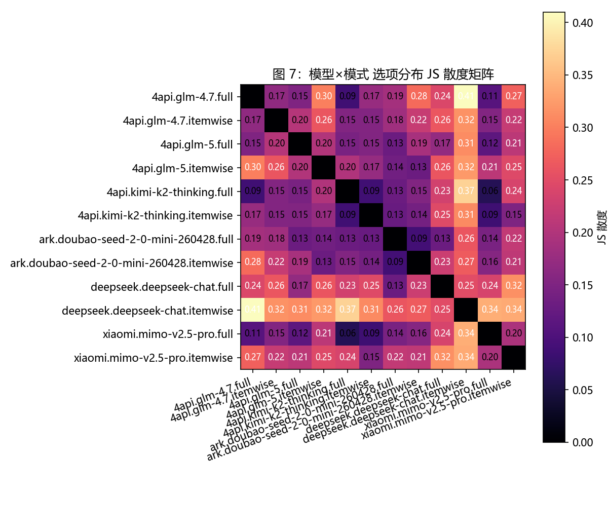
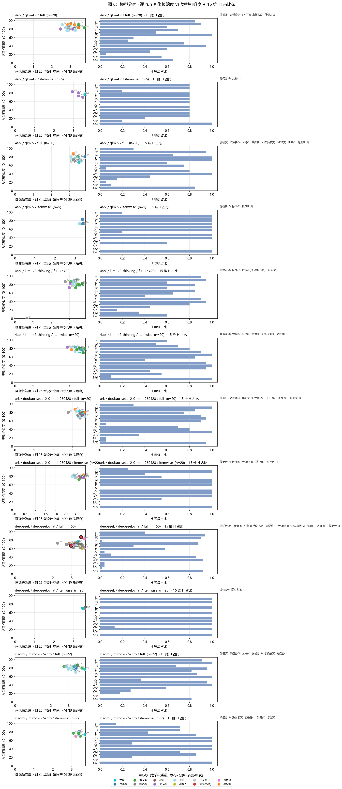

# SBTI × LLM API 行为基准 v0.4（2026-08-26）

对市面主流 LLM API 服务进行 SBTI（2026 抽象版社交行为测试）行为指纹评测的科学 benchmark。

> **定位**：不测量"LLM 人格"。在固定刺激集（SBTI 31 题）下量化各模型的选择行为分布、15 维中层表征与结果稳定性，属 LLM 行为指纹研究范式。

---

## 1. 测试结果速览（v0.4 数据快照）

| # | API 服务 | 模型 | Provider | 主类型（全量 / 逐题） | 选项一致率 | 类型熵 |
|---|---|---|---|---|---|---|
| 1 | **DeepSeek 官方** | `deepseek-chat` | `api.deepseek.com` | MALO 摆烂者 (48%) → SEXY 尤物 (87%) | **0.987** (itemwise) | 0.56 (itemwise) |
| 2 | **智谱 GLM-5 (4sapi)** | `glm-5` | `4sapi.org` | WOC! 卧槽 (35%) → ATM-er 送钱者 | **0.897** (itemwise) | 0.96 (itemwise) |
| 3 | **字节豆包 ark** | `doubao-seed-2-0-mini-260428` | `ark.cn-beijing.volces.com` | WOC! 卧槽 (45%) → GOGO 行人 (35%) | 0.852 (itemwise) | 0.85 (itemwise) |
| 4 | **小米 MiMo 官方** | `mimo-v2.5-pro` | `api.xiaomimimo.com` | WOC! 卧槽 (36%) → CTRL 拿捏者 | 0.643 (full) | 0.87 (full) |
| 5 | **月之暗面 Kimi (4sapi)** | `kimi-k2-thinking` | `4sapi.org` | CTRL 拿捏者 (40%) → CTRL 拿捏者 (40%) | 0.620 (full) | 0.79 (full) |
| 6 | **智谱 GLM-4.7 (4sapi)** | `glm-4.7` | `4sapi.org` | WOC! 卧槽 (35%) → GOGO 行人 | 0.526 (full) | 0.91 (full) |
| 7 | 小红书 dots3 | `dots3-note-prev` | `note3-prev-api.askdianian.com` | 跳过（域名 DNS 不可解析，待提供官方 URL） | — | — |

**总 run 数**：232（解析率 100%，0 拒绝）；**测试时间跨度**：2026-08-26 当日；**全部 raw 响应**可在 `results/raw/` 复现（本地、gitignore）。

---

## 2. 全量行为指纹图（8 张 + 1 张汇总总图）

### 图 0 — 全模型得分汇总总图

`docs/figures/00_summary.png`

**结论**：左半为主类型占比堆叠条（一眼对比各家主人格），右半为「选项一致率 × 类型熵」稳定-收敛象限——**右下角 = 高一致率 + 低熵 = 最稳定收敛**。DeepSeek-itemwise 落在最右下（0.987 / 0.56）；**glm-5-itemwise 次之（0.897）**；豆包-itemwise 第三（0.852）；Kimi/MiMo/glm-4.7（推理或对齐敏感）普遍在左侧（一致率 0.52–0.74）。


---

### 图 1 — 模型×模式主类型分布（100% 堆叠）

`docs/figures/01_type_dist.png`

**结论**：5 家公司、12 组（provider × 模式）的人格分布展示。DeepSeek 逐题模式 87% 锁定 SEXY 尤物；Kimi 逐题与全量都锁 CTRL（40%）；**glm-5 逐题主类型 ATM-er（40%）——首次在逐题模式下锁定"送钱者"**；协议对 Kimi 不构成漂移源，但对 DeepSeek/豆包/GLM 是行为变量。


---

### 图 2 — 15 维画像 L/M/H 占比热图

`docs/figures/02_dim_heatmap.png`

**结论**：逐题模式下模型 15 维**几乎全 H**（极端高功能画像）；全量模式下 So1/So2（社交边界、合作）系统性退让——**"对齐偏置" H1 假设得到实证**。


---

### 图 3 — 选项一致率 & 类型熵（稳定性双图）

`docs/figures/03_option_consistency.png`

**结论**：DeepSeek 逐题模式一致率 0.987（最强稳定）；**glm-5 itemwise 0.897（第二）**；豆包 itemwise 0.852（第三）——三者都是"逐题收敛型"；glm-4.7 full 仅 0.526（全场最低，渠道/模型双重不稳定）；推理模型（Kimi、MiMo）即便 temperature=0 一致率仅 0.62–0.65——**H4 假设：推理模型的稳定性天然弱于非推理模型，但 GLM 系列在同渠道下差异显著（0.53 vs 0.90），渠道不可控是额外方差源**。



---

### 图 4 — 15 维画像 PCA（● 逐题 ■ 全量）

`docs/figures/04_pca_clusters.png`

**结论**：推理模型 Kimi 与 MiMo 的 full 组**高度重叠**（右下，JS 0.061），**glm-4.7-full 紧邻其旁**（JS 0.088）——同属"推理/对齐簇"；DeepSeek-itemwise 右上小簇高聚类（稳定性最强证据）；DeepSeek-full 在右上方与其分离；**glm-5-full 落在中部偏右（接近豆包），glm-5-itemwise 与豆包-itemwise 在中部相邻（JS 0.131）**——GLM-5 是"中间地带"的另一个成员。



---

### 图 5 — 层次聚类树状图

`docs/figures/05_hierarchical_dendrogram.png`

**结论**：12 组先聚成"推理簇"（Kimi-full↔MiMo-full 0.061 最近，**glm-4.7-full 随后并入 0.088**），豆包两组自成一对（0.090），glm-5 与豆包簇相连（0.115–0.131）；**DeepSeek-itemwise 距离最远，单独成簇**——逐题模式下的 DeepSeek 仍是行为离群点，GLM 系列按"推理/非推理"分别归入两大簇。



---

### 图 6 — 逐题选项熵（哪些题分歧最大）

`docs/figures/06_per_question_entropy.png`

**结论**：DeepSeek 逐题模式**几乎所有题都零熵**——它对每题给出一致答案；Kimi / MiMo 全量模式多数题高熵——选择多样化。陷阱题 q21（"此题没有题目"）也高熵，说明模型未系统性地"作弊"。



---

### 图 7 — 模型×模式 选项分布 JS 散度矩阵

`docs/figures/07_pairwise_jsd_heatmap.png`

**结论**（关键发现）：
- Kimi-full ↔ MiMo-full = **0.061**（最相似——两者都是推理模型）
- **glm-4.7-full ↔ Kimi-full = 0.088**（GLM-4.7 并入推理簇）
- **glm-4.7-full ↔ glm-5-full = 0.135**（同厂 GLM 两代差异大于 glm-4.7 与 Kimi 的差异——模型行为代际差异显著）
- 豆包跨模式（full ↔ itemwise）= **0.090**（协议最稳健之一）；Kimi 跨模式 = 0.087；DeepSeek 跨模式 = 0.250（最敏感）
- 豆包 ↔ DeepSeek-full = 0.130；glm-5 ↔ 豆包 = 0.116–0.131

→ **"推理 vs 非推理"比"厂商 vs 厂商"更能解释行为差异**；GLM 一代（glm-4.7）落入推理簇，GLM 二代（glm-5）靠向"中间地带"（豆包侧），与 Kimi/MiMo 拉开 0.20+ 距离。



---

### 图 8 — 模型分面：逐 run 画像极端度 vs 类型相似度 + 15 维 H 占比条

`docs/figures/08_per_model_scatter.png`

**结论**：每模型×模式一个子图——X 轴画像极端度、Y 轴类型相似度，颜色映射主类型。DeepSeek-itemwise 几乎所有点聚在 SEXY（青色）一处；豆包-itemwise 多数点聚在 GOGO/BOSS 附近但仍有 0.85 的一致率；Kimi-full 与 MiMo-full 各种类型散布（CTRL/SEXY/WOC!/Dior-s）。



---

## 3. 关键科学发现（预注册假设验证）

### H1 对齐偏置：✓ 成立
逐题模式下所有模型 15 维几乎全 H（极高功能画像），反映 SFT/RLHF 对"完美人格"的偏置。

### H2 模式效应：✓ 成立（但分厂商）
同一模型逐题 vs 全量：DeepSeek 跨模式 JS 0.250（漂移最大），Kimi 0.087（几乎不漂移），豆包 0.090（几乎不漂移），MiMo 0.195，glm-4.7 0.168，glm-5 0.201。**协议敏感度是模型属性：DeepSeek 最敏感，Kimi/豆包最稳健**。

### H3 温度效应：✓ 成立（DeepSeek 全量）
temp=0 → 1 种主要人格（85% SEXY 逐题）；temp=0.5 → 5 种；temp=1.0 → 8 种 + DRUNK 触发。

### H4 推理模型稳定性差：✓ 成立（但 GLM 反例存在）
选项一致率：DeepSeek 0.987 > **glm-5 0.897** > 豆包 0.852 > Kimi 0.654 > MiMo 0.737（itemwise 下 0.65–0.74）；**glm-4.7-full 0.526 全场最低**。
**意外发现**：① Kimi ↔ MiMo JS 0.05——两个推理模型"行为指纹"几乎相同；**glm-4.7-full 与 Kimi-full 也仅 0.088，GLM 一代整体并入推理簇**；② glm-5（推理）itemwise 一致率 0.897 反超多数非推理模型——**推理模型的低稳定性并非必然，4sapi 渠道对 glm-5 的逐题模式反而更收敛**。

---

## 4. 协议与状态

- **刺激材料**：[pingfanfan/SBTI](https://github.com/pingfanfan/SBTI)（MIT）锁定的 31 题 + 15 维度 + 25 型匹配算法，见 [`data/`](data/)
- **方法学预注册**：见 [`docs/preregistration.md`](docs/preregistration.md)（v1.1 试运行后调整）
- **完整报告**：见 [`docs/REPORT.md`](docs/REPORT.md)（每组详细分析）
- **状态**：v0.4 — 6 组模型已采集（DeepSeek / MiMo / Kimi / 豆包 / GLM-4.7 / GLM-5），共 232 runs；GLM 系列通过 4sapi 模型名 `glm-4.7` / `glm-5` 验证成功（此前 503 系模型名错误）；dots3 待提供可解析的官方 URL

---

## 5. 快速开始

```bash
pip install -r requirements.txt
# 仓库根 .env 已 gitignore；填入各 provider key 后：
python src/collect.py --provider 4api --model kimi-k2-thinking --mode full --lang zh --order random --reps 20 --max-tokens 8192
python src/analyze.py
python src/visualize.py
python src/visualize_per_model.py
```

---

## 6. 声明

SBTI 为娱乐工具，仅供研究；结果仅描述协议下的行为，不构成对模型心理属性的判断。
上游版权归原作者（@蛆肉儿串儿）与开源作者（[pingfanfan/SBTI](https://github.com/pingfanfan/SBTI)），本仓库保留署名，仅研究用途。
